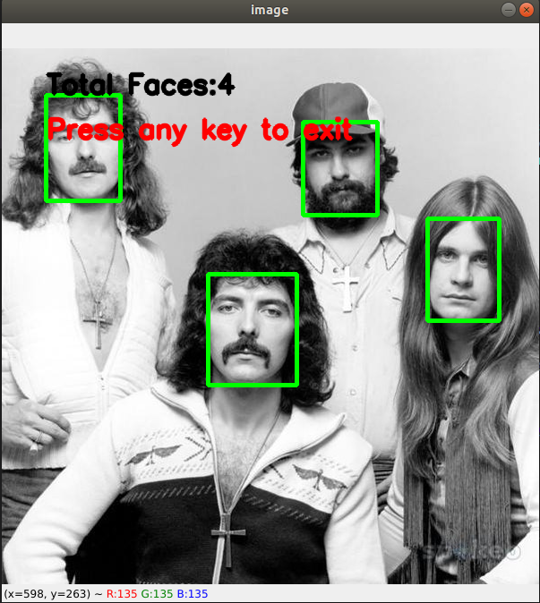
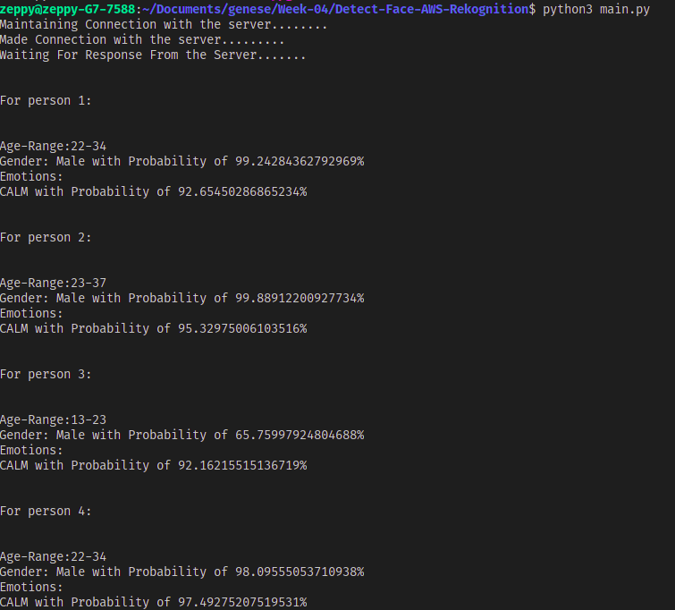

# Detect-Face-AWS-Rekognition

The script uses AWS-Rekognition to detect faces in the input image and it also extracts several details like Age-Range of the face, gender and emotions.

To run the script:
```bash
python main.py
```

### Input Image:


### Output Image with Bounding Box in Face:


### Terminal Output:

